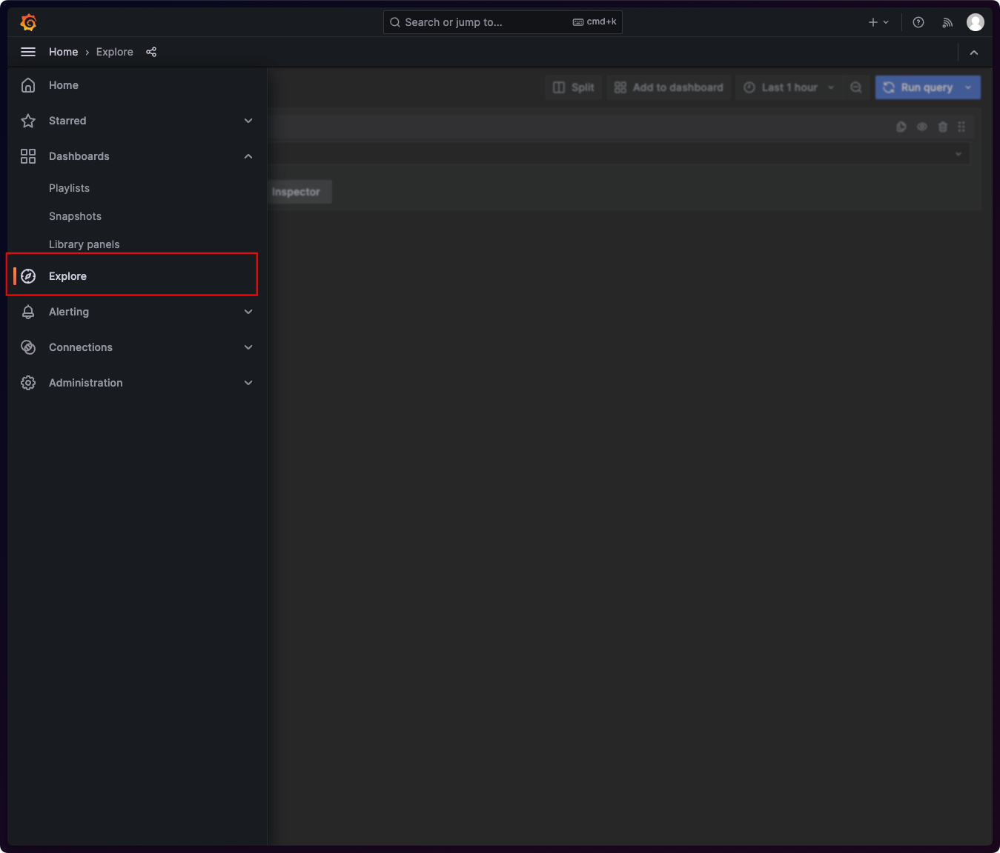
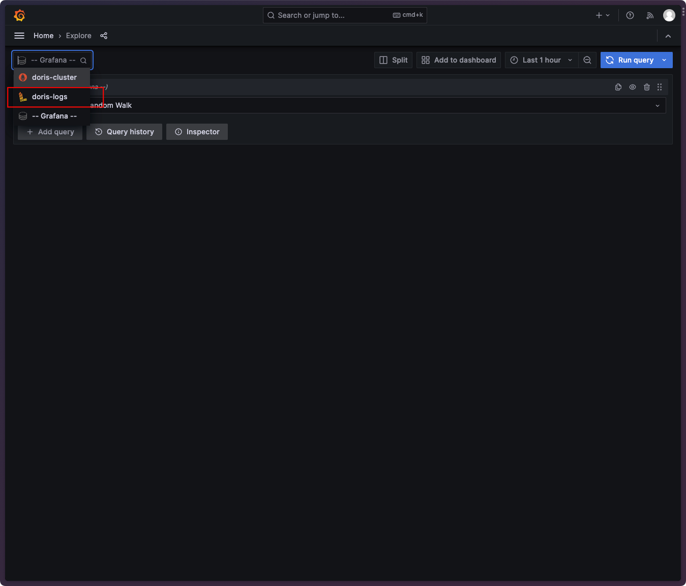
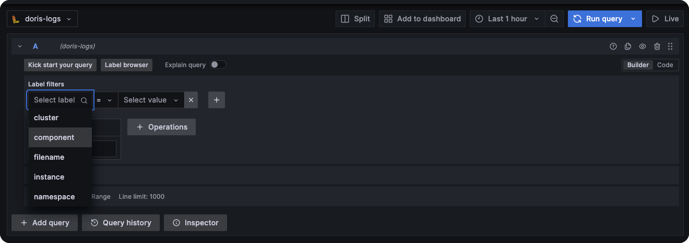
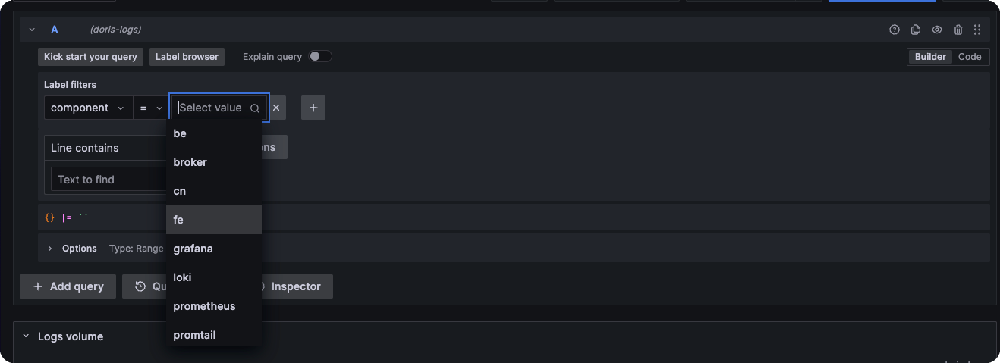
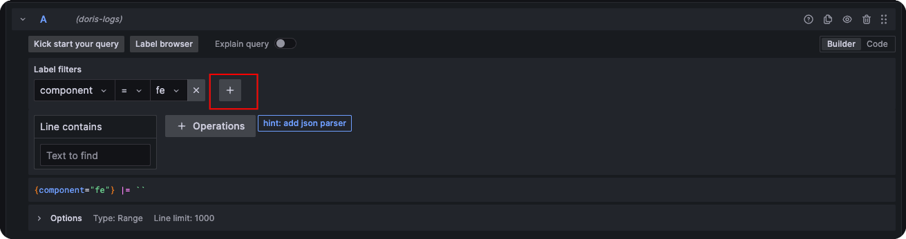
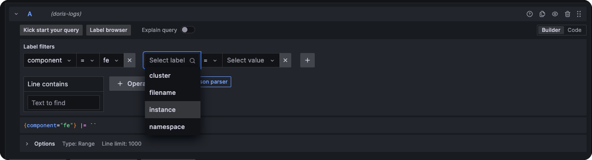
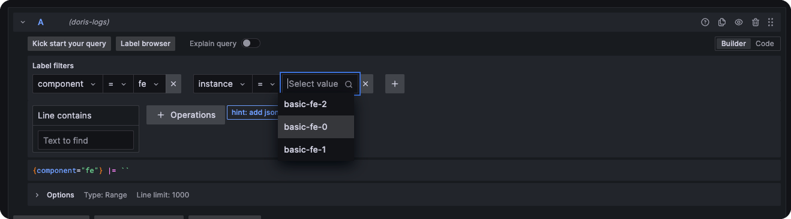
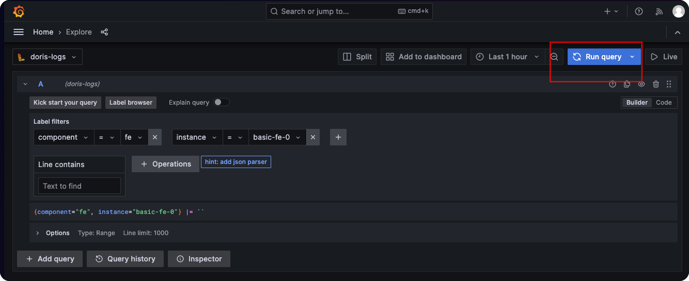

当您部署了 DorisMonitor 后，Doris Operator 会自动将 Doris 集群上所有组件的日志收集到 Loki，您可以直接在 Grafana 上检索这些日志。

## 日志查询入口

## LogQL

Loki 使用 LogQL 作为查询语法，关于 LogQL
的使用，请参考 [Loki Log queries](https://grafana.com/docs/loki/latest/query/log_queries/)。

## 快速筛选 Doris 组件日志

假设您不是十分熟悉 LogQL，也可以通过 Grafana 的交互界面十分便捷地筛选 Doris 组件日志。

以下演示了通过 Label Filters 筛选 Doris FE 组件 “basic-fe-0” 这个 Pod 实例的日志。

1. “Select label” 选择 “component”；

   

2. “Select value” 选择目标的 Doris 组件，这里选择 “fe”

   

3. “+” 添加一个新的 Filter

   

4. “Select label” 选择 “instance”；

   

5. “Select value” 选择目标组件的 Pod 实例；

   

6. 点击 "Run query" 获取日志结果；

   

通过 Grafana Loki，您可以十分方便地实现全体组件错误日志查询，关键字查询等功能，而不必坐牢一般地疯狂在各个 pod 之间 kubectl
logs。
