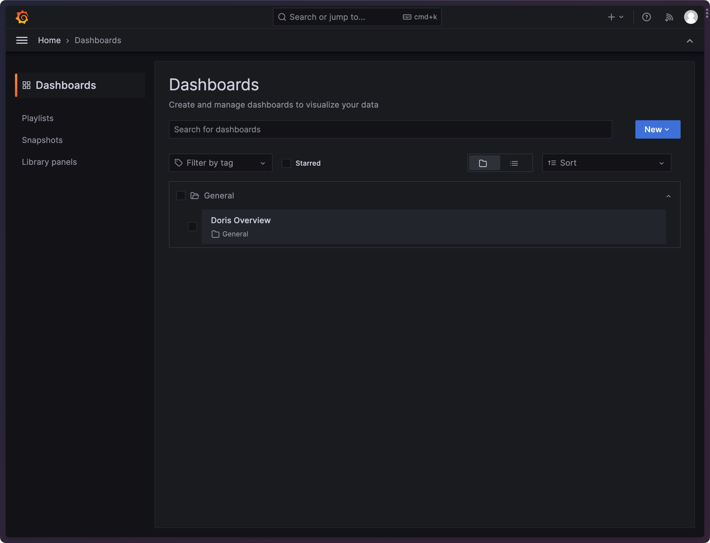
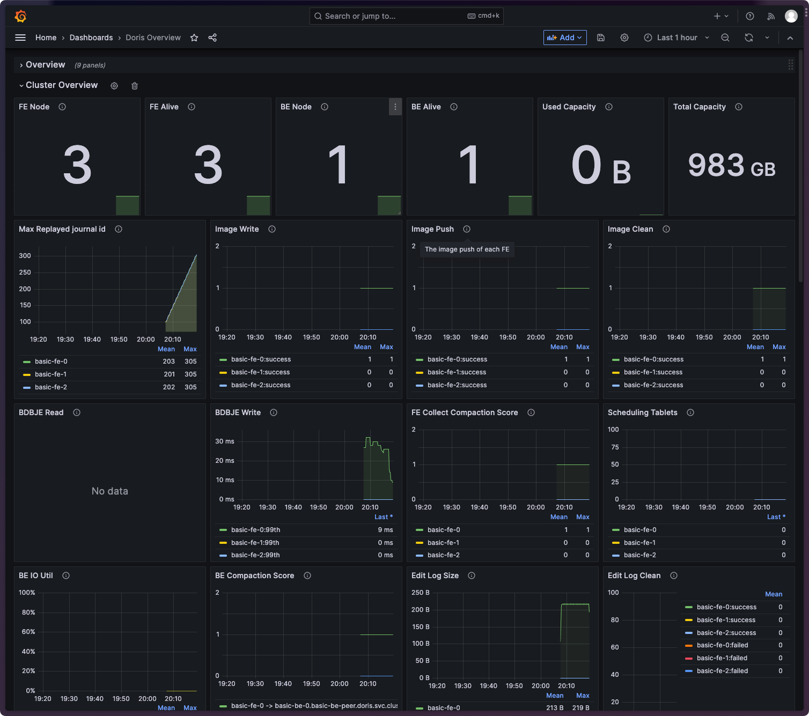
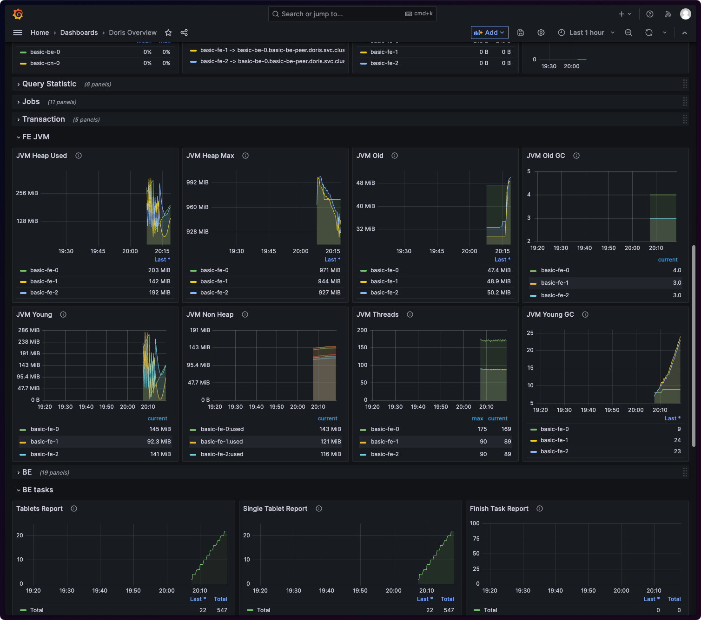

Doris Operator automatically generates a default Grafana dashboard named "Doris Overview," which you can find under
Home/Dashboards.

This dashboard includes key Doris cluster metric charts to provide an overview of the Doris cluster's performance.

